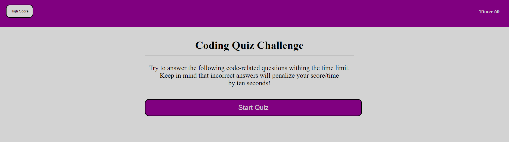
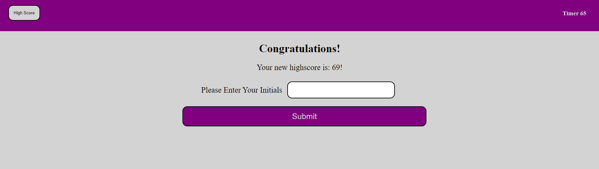
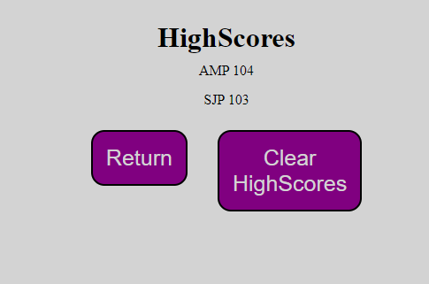

# Code-Quiz

## Purpose
This project started with no code and was built from the groud up.  
I was tasked with building a code quiz that needed to have multiple questions stored and accessed when the quiz started.  
Once the quiz started a timer would start and this timer is what the overall score would be based off of.  
When someone answers a question incorrectly they needed to be penalized for their wrong answer.  
Once the timer ran out or the quiz was completed, the user would be prompted to input their initials.  
Their initials and high score would be stored and displayed proudly.

## Built With
* JavaScript
* HTML
* CSS

## Website
https://drybloodraven.github.io/Code-Quiz/

## Screenshots

## Contribution
Made with ❤️ by Alex Proctor  
Help from Randall Burgess (Tutor) who pushed me in the right direction when I though all hope was lost!